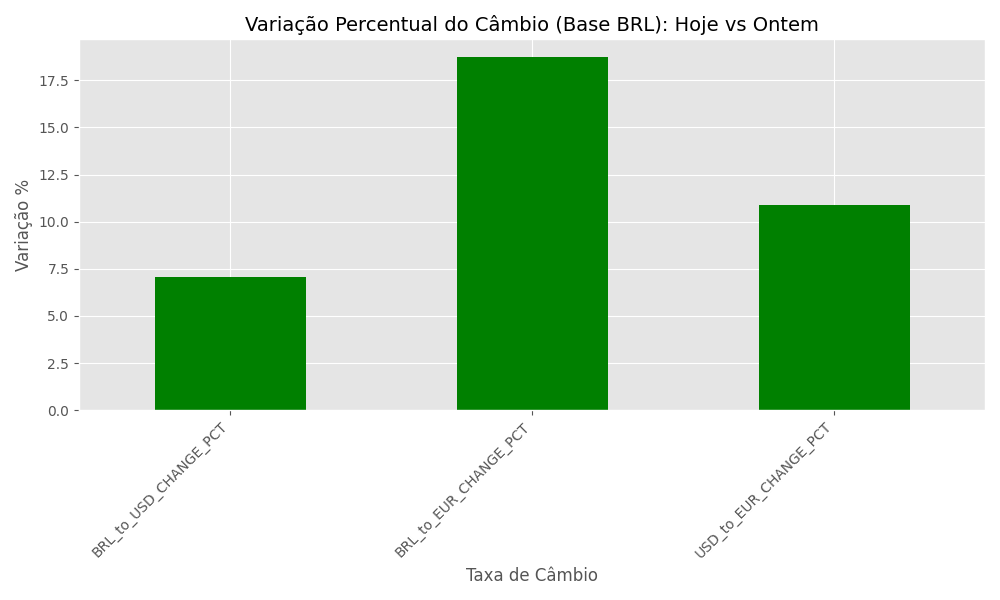

## Trabalho final - Cotações cambiais com Python + LLM

### Grupo 7
Fernanda Cristina Gomes Nori - 2501681
Hedir Saraiva de Albuquerque - 2501140
Felipe Santos Araujo
Felipe Ensinas Alves - 2500260
Felipe Santos Silvino - 2502102
Caio Afonso Felipe Da Silva 2500389
Danilo Pazianotto Oliveira 2500466
Isabelle Tais da Silva Nunes - 2501861

## Objetivo
Este projeto implementa um pipeline de Engenharia de dados (Bronze > Silver > Gold) para coletar taxas de câmbio diárias e enriquecê-las com insights gerados por IA.

## Passo a passo de como foi feito o trabalho

Entramos no site da API (https://www.exchangerate-api.com/), no site solicitamos a KEY que foi gerada e enviada para o email marcado.

Já em posse da Key, conseguimos então criar o arquivo armazenador de chaves, o .env

Para as chaves do LLM, foi escolhida a Gemini, do Google, solicitamos a key através do portal "Google AI Studio", conseguimos assim gerar uma key gratuita.

## Visão geral do projeto.
| Camada | Script | Formato | Propósito |
| :--- | :--- | :--- | :--- |
| **Bronze** | `collect_bronze.py` | JSON | Dados brutos, salvos diretamente da API. |
| **Silver** | `process_silver.py` | CSV | Dados normalizados, limpos e validados (taxas $> 0$). |
| **Gold** | `aggregate_gold.py` | Parquet | Dados agregados, prontos para análise (com cálculos como USD/EUR). |
| **Relatório** | `analysis_report.py` | PNG + Texto (LLM) | Gera gráfico de variação diária e resumo executivo com IA. |

## Instruções de execução.
| Comando | Descrição |
| :--- | :--- |
| `python collect_bronze.py` | Coleta o câmbio de hoje e salva em `/bronze/YYYY-MM-DD.json`. |
| `python process_silver.py` | Lê o Bronze, **valida dados** (qualidade), normaliza e salva em `/silver/...csv`. |
| `python aggregate_gold.py` | Lê o Silver, faz **agregações** e salva o resultado final em `/gold/...parquet`. |
| `python analysis_report.py` | **Gera o gráfico** de variação diária e **análise executiva (LLM)**. |

## Gráfico de Variação Diária

Este relatório visualiza a variação percentual do câmbio (hoje vs. ontem), gerada pela etapa final da pipeline (`analysis_report.py`).

## Entregáveis
| Item | Status | Detalhes |
| :--- | :--- | :--- |
| **Código no GitHub** | Concluído | Repositório com todo o código fonte. |
| **README** | Concluído | Documentação completa do projeto. |
| **Dados Limpos** | Concluído | Arquivos finais de câmbio em `/gold/...parquet`. |
| **Relatórios/Insights**| Concluído | Arquivo PNG (`exchange_report_...png`) e resumo do LLM no terminal. |
| **Testes Unitários** | Concluído | Código de testes em `tests/test_validation.py`. |
| **Observabilidade** | Concluído | Logging estruturado (`logging` ou `structlog`) em nível INFO/ERROR. |